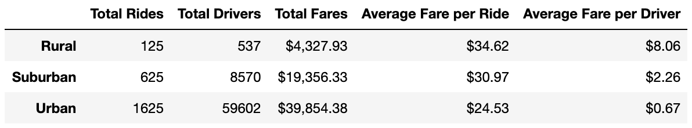

# pyber_analysis
## Overview
The purpose of this analysis was to provide in-depth insight into the success of rural, suburban, and urban markets for based on Pyber's data.

## Results: 
Using images from the summary DataFrame and multiple-line chart, describe the differences in ride-sharing data among the different city types.
 

The analysis shows that Urban cities bring in the greatest revenue, followed by Suburban cities, then Rural cities. Overall, Urban cities account for about 63% of total fares. Similarly, Urban cities account for approximately 68% of total rides, followed by Suburban cities at 26%, and Rural cities at 5%. The ratio of rides to drivers in Rural cities is 0.23, while the ratio is 0.07 in Suburban cities, and 0.03 in Urban cities.

## Summary: 
Based on the results, provide three business recommendations to the CEO for addressing any disparities among the city types.
