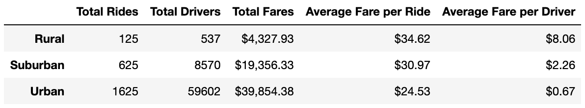
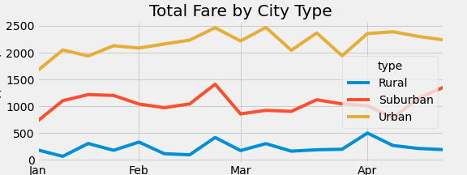

# pyber_analysis
## Overview
The purpose of this analysis was to provide in-depth insight into the success of rural, suburban, and urban markets for based on Pyber's data.

## Results: 

 

- The analysis shows that Urban cities bring in the greatest revenue, followed by Suburban cities, then Rural cities. 
- Overall, Urban cities account for about 63% of total fares. Similarly, Urban cities account for approximately 68% of total rides, followed by Suburban cities at 26%, and Rural cities at 5%. 
- The ratio of rides to drivers in Rural cities is 0.23, while the ratio is 0.07 in Suburban cities, and 0.03 in Urban cities.
- The average fare for Rural rides is approximately $35, which is 40% higher than the average Urban city rate ($25).

## Summary: 
Based on the results, provide three business recommendations to the CEO for addressing any disparities among the city types.
1. Incentivize more rural drivers to sign up in order to help balance the ratio of drivers to rides.
2. Focus marketing campaigns on generating more rides in Urban areas in order to balance demand with supply in urban areas.
3. January is a slower month in terms of revenue, so this is a good time to increase marketing efforts to ensure steady demand.
